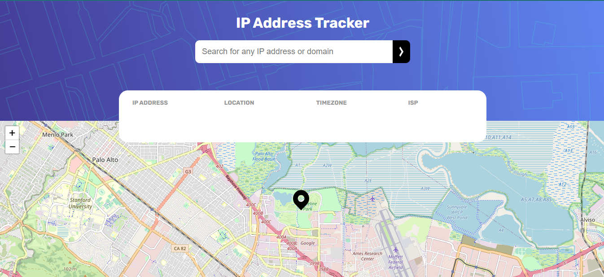
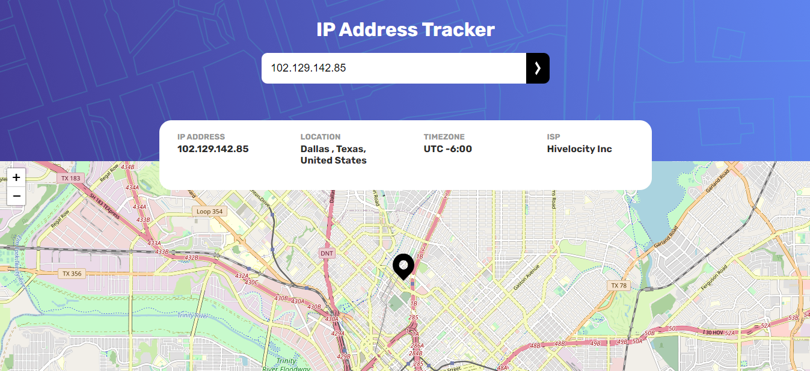
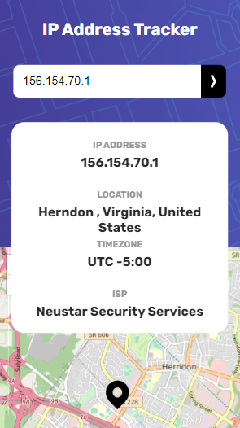

# Frontend Mentor - IP address tracker solution

This is a solution to the [IP address tracker challenge on Frontend Mentor](https://www.frontendmentor.io/challenges/ip-address-tracker-I8-0yYAH0). Frontend Mentor challenges help you improve your coding skills by building realistic projects.

## Table of contents

- [Overview](#overview)
  - [The challenge](#the-challenge)
  - [Screenshot](#screenshot)
  - [Links](#links)
- [My process](#my-process)
  - [Built with](#built-with)
  - [What I learned](#what-i-learned)
  - [Useful resources](#useful-resources)
- [Author](#author)

## Overview

### The challenge

Users should be able to:

- View the optimal layout for each page depending on their device's screen size
- See hover states for all interactive elements on the page
- See their own IP address on the map on the initial page load
- Search for any IP addresses or domains and see the key information and location

### Screenshot





### Links

- Solution URL: https://www.frontendmentor.io/solutions/responsive-ip-address-tracker-using-api--t9IbWpL-o
- Live Site URL: https://ip-address-tracker-three-alpha.vercel.app/

## My process

### Built with

- Semantic HTML5 markup
- CSS custom properties
- Flexbox
- Mobile-first workflow
- JavaScript
- Fetch API - JavaScript API for making HTTP requests.
- IPGeolocation.io API - External API for fetching IP geolocation data.
- Leaflet.js - JavaScript library for interactive maps.
- Custom Marker Icon - Customizing map markers for location representation.

### What I learned

During my learning journey, I delved into various aspects of web development. I grasped the art of positioning elements on web pages using CSS, where I learned about the intricacies of the `position` property, and how `absolute`, `relative`, and `fixed` positioning can shape the layout.

I ventured into the realm of data retrieval with the Fetch API, which enabled me to make asynchronous requests to external resources, such as the [IPGeolocation.io API](https://app.ipgeolocation.io/). This invaluable API provided me with geolocation data based on IP addresses, and I mastered the art of handling asynchronous operations using `async` and `await` in JavaScript.

In the process, I honed my skills in converting JSON data from API responses into JavaScript objects, making it easier to work with and manipulate the data in my web applications.

One of the highlights of my learning journey was discovering the [Leaflet.js](https://leafletjs.com/) library, a powerful tool for creating interactive maps. I explored its extensive functionalities, from displaying maps and adding markers to customizing them to my heart's content. I even replaced the default markers with my own custom icons, adding a personal touch to my maps.

This journey has been an exciting and enriching experience, equipping me with the skills to build dynamic and interactive web applications that can fetch and display data from external sources, create stunning maps, and provide a seamless user experience. The possibilities are endless, and I'm eager to continue exploring and applying what I've learned to create even more impressive projects in the future.
To see how you can add code snippets, see below:


```js
	map = L.map("map").setView([lat, lng], 13);
	L.tileLayer("https://tile.openstreetmap.org/{z}/{x}/{y}.png", {
		maxZoom: 19,
		attribution:
			'&copy; <a href="http://www.openstreetmap.org/copyright">OpenStreetMap</a>',
	}).addTo(map);

	const myIcon = L.icon({
		iconUrl: "./images/icon-location.svg",
		iconSize: [36, 46],
		iconAnchor: [22, 94],
		popupAnchor: [-3, -76],
		shadowAnchor: [22, 94],
	});

	L.marker([lat, lng], { icon: myIcon }).addTo(map);
```

### Useful resources

- [Leaflet.js Documentation](https://leafletjs.com/) - This comprehensive documentation was instrumental in my journey with maps and geolocation. I particularly appreciated the clear explanations and extensive examples. The ability to customize markers with my own icons was a game-changer, and I'll definitely be using Leaflet.js for my future mapping projects.

- [IPGeolocation.io API Documentation](https://app.ipgeolocation.io/) - This API documentation proved to be a valuable resource in my web development journey. It provided me with access to geolocation data based on IP addresses, and the detailed documentation made integration a breeze. It was especially helpful in mastering asynchronous operations with JavaScript's Fetch API and handling JSON responses effectively. I highly recommend it to anyone looking to incorporate geolocation data into their web applications.

## Author

- Website - [Muhammad Kabir Kaka](https://www.your-site.com)
- Frontend Mentor - [@KabirKaka](https://www.frontendmentor.io/profile/KabirKaka)
- Linkedin - [@Muhammad Kabir Kaka](https://www.linkedin.com/in/muhammad-kabir-kaka/)


